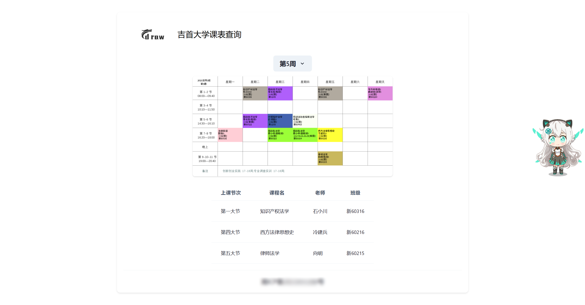
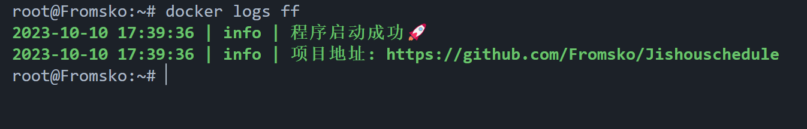
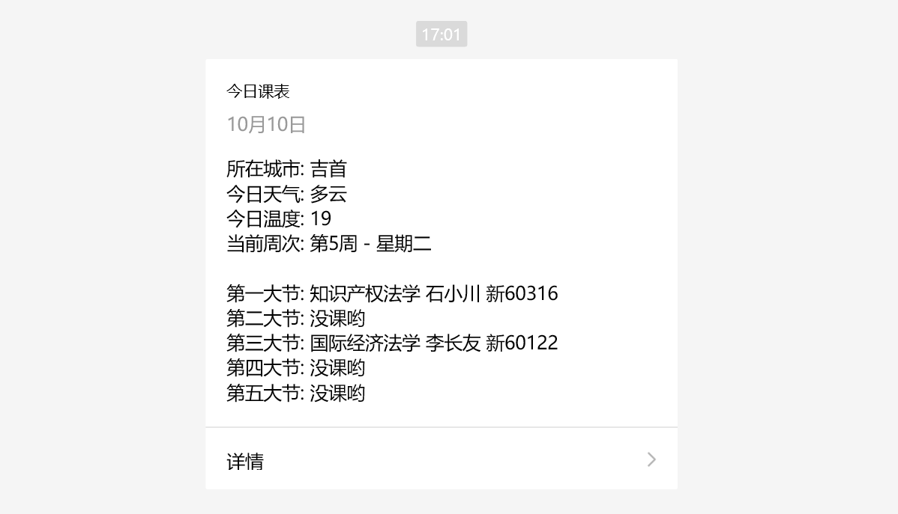
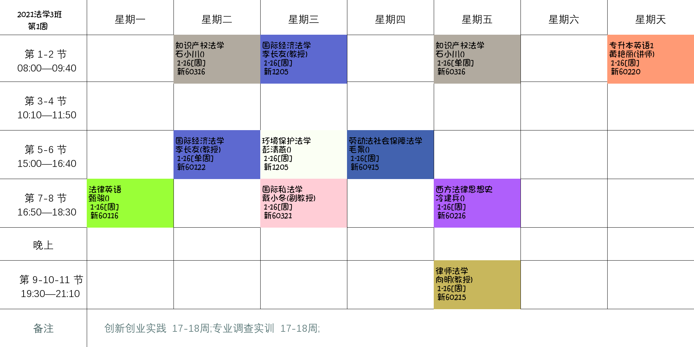

# **课表绘制**

<div align="center">

## 

📅 **吉首大学个人课表绘制**

🛠️ 简化课程表查询和生成课表图片的流程

---

</div>

## 📑 功能特点

- 自动化课程表数据爬取。
- 可自定义课表样式和颜色。
- 支持定时任务，定期更新课表。
- 提供简单的 FastAPI 接口，方便集成到其他应用中。

---

`配套应用`

- [前端应用](./frontend/)：前端页面数据展示
  
- [微信推送](./notify/)：推送数据到微信测试号
  
  

## 📦 安装

首先，确保您的 `Python` 版本为 **3.9** 或更高。然后，执行以下步骤来安装项目：

**通用安装：**

```bash
pip install -r requirements.txt
playwright install chromium
```

**推荐安装：**

```bash
pip install pipenv
pipenv install
playwright install
pipenv shell
```

## 🚀 快速开始

1. 填写配置文件 `./config.json`

   ```json
   {
     "username": "xxxx",
     "password": "xxxx"
   }
   ```

2. 启动应用程序 `main.py`

   ```bash
   cd JishouSchedule
   python main.py
   ```

3. 访问项目文档：

   - 打开浏览器访问 <http://localhost:2000/docs> 查看接口文档

   - 访问 `http://host:port` 查看前端显示

4. 绘制个人课表：
   - 使用接口文档中的示例请求，获取您的个人课表并生成图片。

## 🔗 示例请求

### 获取课表数据

- **请求地址:** `http://host:prot/get_cname_data?week=1`
- **请求方式:** `GET`
- **返回格式:** `json`

```json
{
  "code": 200,
  "data": {...},
  "week": "第X周"
}
```

### 获取课表图片

- **请求地址:** `http://host:prot/get_cname_table?week=1`
- **请求方式:** `GET`
- **返回格式:** `image`

<div align="center">
  
</div>

## 🙏 鸣谢

感谢以下开源项目，它们为本项目的开发提供了重要支持：

- [Pillow](https://pillow.readthedocs.io/en/stable/): 🖼️ 用于图像处理的 Python 库。
- [APScheduler](https://apscheduler.readthedocs.io/en/stable/): 🕒 用于定时任务的 Python 库。
- [Playwright](https://playwright.dev/): 🌐 用于自动化网页爬取的工具。
- [FastAPI](https://fastapi.tiangolo.com/): 🚀 用于构建高性能 API 的 Python 框架。

## ©️ 许可

本项目基于 MIT 许可证，请查阅 LICENSE 文件以获取更多信息。
