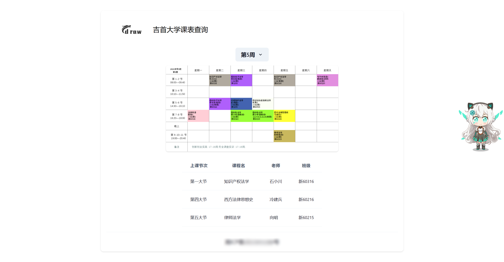

# **课表查询**

<div align="center">

## 

📅 **吉首大学课表查询**

🛠️ 简化查询流程

---

</div>

## 📑 功能特点

- 自动展示本周课表信息
- 可以直接下载
- 响应式布局

## 🚀 快速开始

1. 填写后端地址 `./src/components/CnameData.jsx`

   ```jsx
   export const ApiURL = 'http://1.117.154.114:20000'
   ```

2. 📦 安装并启动应用

   ```bash
   cd frontend
   npm i
   npm run dev
   ```

3. 展示

<div align="center">
   
</div>

## 🔗 访问

- **请求地址:** `http://host:prot`

## 🙏 鸣谢

感谢以下开源项目，它们为本项目的开发提供了重要支持：

- [React](https://github.com/facebook/react): 一个 `js` 框架
- [chakra-ui](https://github.com/chakra-ui/chakra-uichakra-ui): 🌐 用于构建用户界面
- [Vite](https://github.com/vitejs/vite): 🚀 下一代前端工具，它的速度很快！

## ©️ 许可

本项目基于 MIT 许可证，请查阅 LICENSE 文件以获取更多信息。
